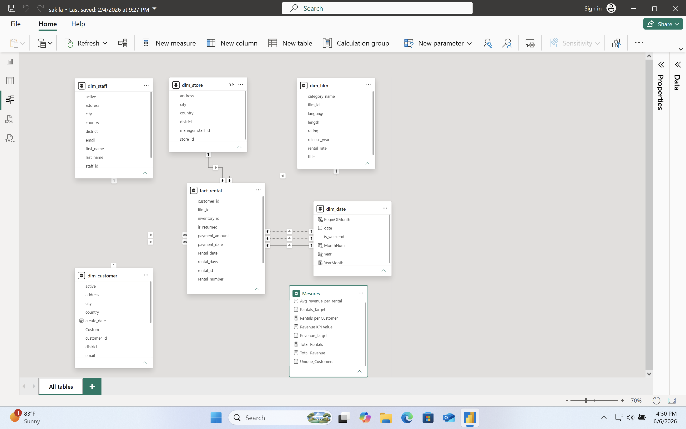
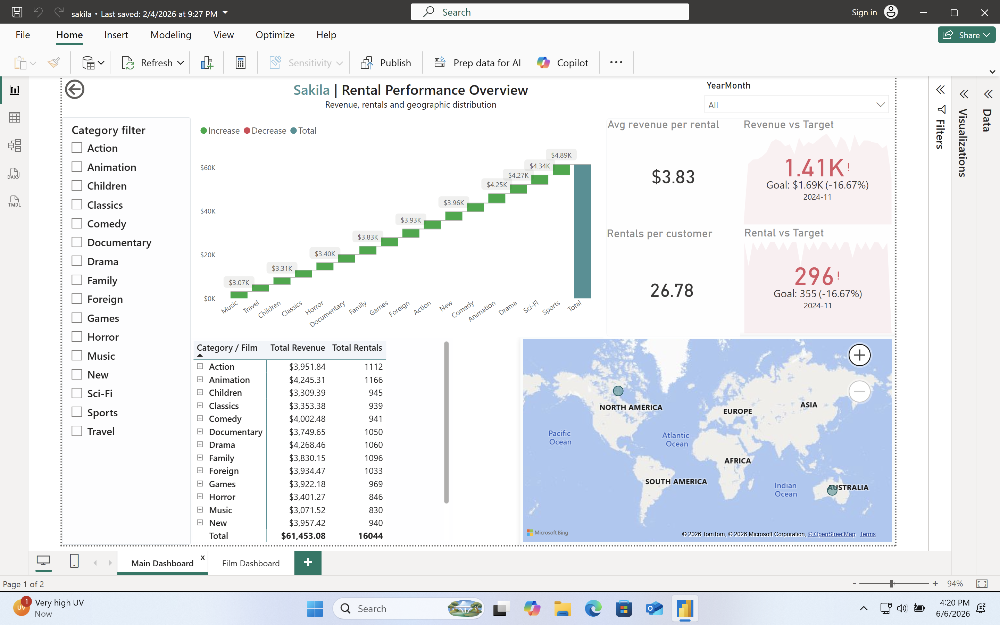
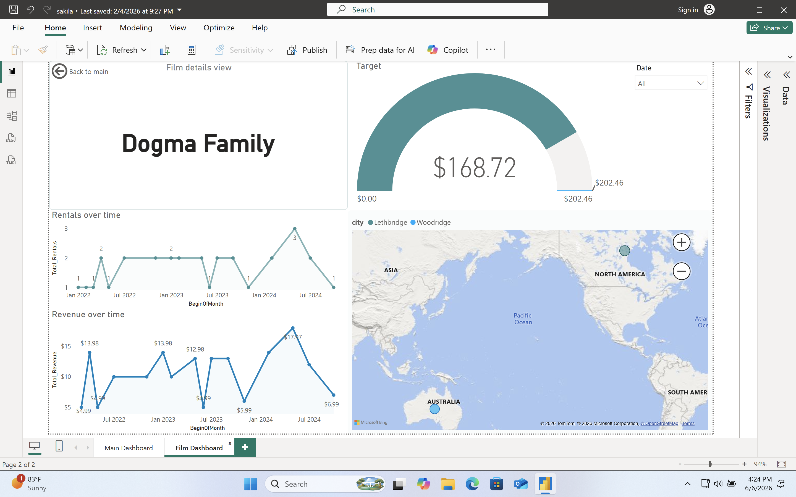

# 🎬 Sakila Rental Analytics Dashboard

## Project Overview

This project presents an interactive Power BI dashboard built using the Sakila movie rental database.

The goal of the project was to design a dimensional data model, create analytical measures using DAX, and build business-oriented dashboards for monitoring rental performance, customer behavior, and revenue trends.

The solution includes a star schema model, KPI tracking, drill-through functionality, geographic analysis, and category-level performance reporting.

---

# 🛠 Tools Used

- Power BI Desktop
- DAX
- PostgreSQL (data source)
- Star Schema Data Modeling

---

# 📊 Data Model

The dashboard is built on a star schema model with a central fact table and supporting dimensions.

### Fact Table

- fact_rental

### Dimension Tables

- dim_customer
- dim_film
- dim_store
- dim_staff
- dim_date

### Measures Table

Contains business KPIs and DAX calculations.

---

# 📈 Main Dashboard

The main dashboard provides a high-level overview of rental activity and revenue performance.

### Features

- Revenue KPI tracking
- Rental KPI tracking
- Revenue vs Target analysis
- Average revenue per rental
- Rentals per customer
- Revenue by film category
- Geographic distribution of rentals
- Category filtering
- Monthly analysis

---

# 🎥 Film Drill-Through Dashboard

The drill-through page provides detailed analysis for individual films.

### Features

- Film-level revenue tracking
- Rental trend analysis
- Revenue trend analysis
- Revenue target comparison
- Geographic rental distribution

Users can navigate directly from the main dashboard to investigate specific film performance.

---

# 📐 DAX Measures

Examples of business metrics implemented in the project:

- Total Revenue
- Total Rentals
- Unique Customers
- Revenue Target
- Rentals Target
- Average Revenue per Rental
- Rentals per Customer
- KPI Performance Indicators

---

# 🔍 Key Insights

The dashboard enables users to:

- Identify top-performing film categories
- Monitor revenue performance against targets
- Analyze customer rental behavior
- Explore rental trends over time
- Compare film-level performance
- Investigate geographic distribution of rentals

---

# 🚀 Skills Demonstrated

- Data Modeling
- Star Schema Design
- DAX Calculations
- KPI Development
- Dashboard Design
- Drill-Through Navigation
- Data Visualization
- Business Performance Analysis
